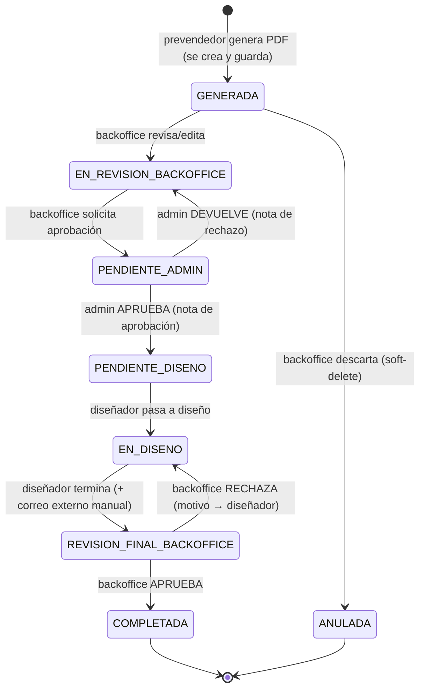

# Arquitectura — Sistema de Control Interno EB

> Modelo de datos, roles, máquina de estados y matriz de permisos. Es la **fuente de verdad** del flujo. Si algo del comportamiento cambia, se edita este documento en el mismo cambio (Regla Absoluta #4).

---

## 1. Roles

| Rol (id) | Qué hace |
|----------|----------|
| `prevendedor` | Crea cotizaciones. **Al generar el PDF, la cotización ya se crea y se guarda** (no hay paso de "enviar"). Ve **solo las suyas**. |
| `backoffice` | Ve las cotizaciones de todos los prevendedores; puede **descartarlas** (anular) o **revisarlas/editarlas**; solicita aprobación al admin; da el visto bueno final al diseño. |
| `admin` | Aprueba o devuelve cotizaciones a backoffice (con nota). Ve todo. |
| `disenador` | Recibe cotizaciones aprobadas, las pasa a "en diseño", crea los planos (externo) y las reenvía a backoffice. |
| `superadmin` | **Dueño del sistema.** Gestiona **usuarios y roles**. Acceso total; puede actuar como admin. |

> **Gestión de usuarios:** la hace el `superadmin` (crear usuarios, asignar/cambiar roles, activar/desactivar). El **primer superadmin (bootstrap)** se crea con un script local usando Admin SDK o dando de alta el usuario en la consola de Firebase y marcando su rol en Firestore a mano una sola vez.

---

## 2. Máquina de estados de una cotización



### Estados (constantes)
`GENERADA` · `EN_REVISION_BACKOFFICE` · `PENDIENTE_ADMIN` · `PENDIENTE_DISENO` · `EN_DISENO` · `REVISION_FINAL_BACKOFFICE` · `COMPLETADA` · `ANULADA`

> **`GENERADA`** es el estado de entrada: se crea automáticamente cuando el prevendedor genera el PDF. **`ANULADA`** es un *soft-delete* (Regla Absoluta #7): el backoffice la descarta de las bandejas activas, pero el registro y su historial se conservan para trazabilidad — no se borra físicamente.

---

## 3. Matriz de permisos (quién puede hacer cada transición)

| Transición | Rol autorizado | Requiere nota |
|-----------|----------------|:---:|
| crear/generar → `GENERADA` | prevendedor | – |
| `GENERADA` → `ANULADA` (descartar) | backoffice | opcional |
| `GENERADA` → `EN_REVISION_BACKOFFICE` (revisar) | backoffice | – |
| editar contenido | backoffice | – |
| `EN_REVISION_BACKOFFICE` → `PENDIENTE_ADMIN` | backoffice | nota opcional · **datos de pago obligatorios** ⁽¹⁾ |
| `PENDIENTE_ADMIN` → `PENDIENTE_DISENO` (aprueba) | admin | ✅ nota aprobación |
| `PENDIENTE_ADMIN` → `EN_REVISION_BACKOFFICE` (devuelve) | admin | ✅ nota rechazo |
| `PENDIENTE_DISENO` → `EN_DISENO` | disenador | – |
| `EN_DISENO` → `REVISION_FINAL_BACKOFFICE` | disenador | – |
| `REVISION_FINAL_BACKOFFICE` → `COMPLETADA` (aprueba) | backoffice | opcional |
| `REVISION_FINAL_BACKOFFICE` → `EN_DISENO` (rechaza) | backoffice | ✅ motivo |
| gestionar `usuarios` (crear/editar/roles) | superadmin | – |

> El `superadmin` puede además realizar cualquier transición de `admin` y ver todo.

> ⁽¹⁾ **Datos de pago obligatorios al solicitar aprobación.** Antes de enviar la
> cotización al admin, el backoffice debe completar el método de pago y su dato
> requerido: **Contado** → N° de comprobante de pago; **Crédito** → casilla
> «Cotización aprobada». La casilla «Muestra enviada por correo» es la misma
> (opcional) en ambos métodos. Lo hace cumplir el frontend (`validarPago`, que
> deshabilita el botón «Confirmar») y el pago viaja en el **mismo `writeBatch`**
> que el cambio de estado (atómico). Las Security Rules autorizan por la rama
> `transicionValida() && eventoEspejoUpdate()`, que no restringe el campo `pago`.

### Visibilidad (lectura)
- `prevendedor`: solo sus propias cotizaciones.
- `backoffice`: todas (excepto `ANULADA` fuera de la vista de descartadas).
- `admin`: todas.
- `disenador`: las que están en `PENDIENTE_DISENO`, `EN_DISENO`, o que él trabajó.
- `superadmin`: todo.

---

## 4. Modelo de datos (Firestore)

### `usuarios/{uid}`
```
{
  nombre: string,
  email: string,
  rol: 'prevendedor' | 'backoffice' | 'admin' | 'disenador' | 'superadmin',
  activo: boolean,
  whatsapp?: string,
  creadoPor: uid,
  createdAt: timestamp
}
```
> El `rol` se lee en las Security Rules vía `get(/usuarios/$(uid))`. Mejora futura: replicar el rol en **custom claims** de Auth (requiere Admin SDK / script) para reglas más rápidas.

### `cotizaciones/{cotizacionId}`
```
{
  consecutivo: string,           // ej. STE2307-01 (ver reglas del legacy)
  estado: <ESTADO>,
  prevendedorId: uid,
  backofficeId?: uid,
  disenadorId?: uid,
  cliente: { nombre, contacto?, ... },
  productos: [ { cod, producto, tamano, impresion1, impresion2, material,
                 cantidad, precioSinIVA, iva, totalConIVA, precioUnitario } ],
  totales: { subtotal, iva, total, totalUSD },
  tipoCambio: number,
  notaActual?: string,           // última nota de aprobación/rechazo
  ultimoEvento: {                // ESPEJO del último evento (Regla Absoluta #2)
    estadoAnterior, estadoNuevo, usuarioId, rol, nota, timestamp
  },                             // las Security Rules lo EXIGEN en cada transición y en el create
  createdAt: timestamp,
  updatedAt: timestamp
}
```

### `cotizaciones/{id}/historial_estados/{eventoId}`  (subcolección — trazabilidad)
```
{
  estadoAnterior: <ESTADO> | null,
  estadoNuevo: <ESTADO>,
  usuarioId: uid,
  rol: string,
  nota?: string,
  timestamp: timestamp
}
```

### `catalogo/{productoId}`  (importado del Sheets `BaseDatos`)
```
{ cod, producto, tamano, minimo, impresion1, impresion2, material,
  precioSinIVA, precioEnUsd: boolean, activo: boolean }
```

### `config/general`  (singleton — importado de `Configuracion`)
```
{ tipoCambioManual, iva, nombreEmpresa, telefono, direccion, cedulaJuridica }
```

### `condiciones/{articulo}`  (importado de `Condiciones`)
```
{ articulo, texto }
```

### `contadores/{prefijo}`  (contador atómico del consecutivo)
```
{ valor: int, prefijo?: string, creadoEn?: timestamp, actualizadoEn?: timestamp }
```
> **Consecutivo a prueba de concurrencia (sin Cloud Functions).** La clave del
> documento es el **prefijo** del consecutivo `[3 letras vendedor]+[ddMM]` (ej.
> `STE2307`), y `valor` es la última secuencia usada ese día para ese vendedor.
> La reserva del número y la creación de la cotización ocurren en **una misma
> `runTransaction`** (`services/cotizaciones.crearCotizacion`): se lee el
> contador, se calcula `valor+1`, se **incrementa el contador** y se **crea la
> cotización** con el consecutivo `PREFIJO-NN` — todo atómico. Firestore
> serializa/reintenta los intentos concurrentes, así que **nunca** se emite el
> mismo consecutivo dos veces, aunque varios prevendedores generen a la vez.
>
> **Semántica:** contador **por-día-por-prefijo** (reinicia en `01` cada día por
> vendedor, idéntico al legacy) — no global monótono. Se eligió porque (a)
> reproduce exacto la numeración que ve el cliente en el PDF, (b) al llavear el
> contador con el **mismo prefijo visible**, la cadena consecutivo resultante es
> **globalmente única** (elimina la colisión del viejo esquema por-tiempo), y (c)
> reparte las escrituras entre muchos docs contador en vez de uno "caliente".
> El formato visible es `STE2307-01`, `STE2307-02`, … (mín. 2 dígitos).

---

## 5. Modelo de seguridad (resumen)

- **Autenticación obligatoria** para todo (no hay acceso anónimo, a diferencia del sistema viejo).
- Cada regla valida: (a) que el usuario esté autenticado y `activo`, (b) su `rol` (leído de `usuarios/{uid}`), (c) que la transición de estado sea válida para ese rol (comparando `estado` anterior vs nuevo).
- **Rastro obligatorio (Regla Absoluta #2):** toda escritura de `cotizaciones` que cambia `estado` (y el `create`) debe traer un mapa `ultimoEvento` coherente (estadoAnterior/estadoNuevo/usuarioId/rol/nota/timestamp), y la nota es obligatoria en las transiciones que la matriz marca. Las reglas lo EXIGEN. El servicio además escribe el evento en la subcolección `historial_estados` en el mismo `writeBatch`.
- **Limitación conocida:** Firestore Rules no puede exigir escritura CRUZADA (doc + subcolección) atómicamente; por eso el rastro obligatorio en reglas es el espejo `ultimoEvento` en el propio doc. La traza histórica completa (subcolección) la garantiza el servicio (`writeBatch`). Migrable a Cloud Functions si se requiere garantía servidor.
- `usuarios` solo lo escribe el `superadmin`. `historial_estados` es append-only (create con `usuarioId`+`rol` propios; sin update/delete).
- `catalogo`/`config`/`condiciones`: lectura para usuarios activos; escritura solo `admin`/`backoffice`/`superadmin`.
- `contadores/{prefijo}` (consecutivo): lectura para usuarios activos (la transacción necesita leerlo). Escritura **solo** `prevendedor`/`superadmin` (los que crean cotizaciones) y **solo incrementos válidos**: en `create` el valor arranca **exactamente en 1**; en `update` el valor sube **exactamente +1** (`is int`, nunca baja ni salta ni se fija arbitrariamente). `delete` prohibido. Así el número es estrictamente creciente y a prueba de manipulación. *Limitación conocida (mismo espíritu que el espejo `ultimoEvento`):* las reglas no pueden atar la **clave** del contador al vendedor real ni verificar en cross-doc que el `consecutivo` escrito en la cotización coincida con el reservado; eso lo garantiza el **servicio** dentro de la transacción. Un prevendedor autenticado podría, a lo sumo, incrementar el contador de otro prefijo (genera un hueco, no un duplicado). No hay colisiones en la ruta honesta.

*(Reglas implementadas y desplegadas: `firestore.rules` (raíz). Tests: `tests/firestore-rules.test.js` (emulador) + `tests/dominio.test.js` + `tests/consecutivo.test.js` + `tests/mejoras-backoffice.test.js`. Deploy: `node tools/deployRules.js`.)*

---

## 6. Pendientes técnicos abiertos

- **Tipo de cambio BCCR:** sin Cloud Functions (plan Spark), el navegador no puede llamar al BCCR por CORS. Opciones a decidir en Fase 4: (a) el admin fija el tipo de cambio manual en `config/general`; (b) reutilizar un mini-endpoint Apps Script solo para el tipo de cambio; (c) mover a Blaze + función programada. **Default provisional:** tipo de cambio manual editable por admin, con opción de actualizar.
- ~~**Numeración consecutiva:** portar la lógica del legacy (`[3 letras vendedor]+[ddMM]+[secuencia]`) usando una transacción de Firestore o un contador.~~ **RESUELTO:** colección `contadores/{prefijo}` + reserva atómica en la misma `runTransaction` que crea la cotización (`services/cotizaciones.crearCotizacion`, helpers en `services/consecutivo.js`). Contador por-día-por-prefijo; secuencia del contador (no del tiempo). Reglas: solo `prevendedor`/`superadmin`, solo incrementos +1. Ver §4/§5.
- **Primer superadmin (bootstrap):** definir cómo se crea el primer usuario superadmin (script local con Admin SDK vs. alta manual en consola Firebase + marcar su rol en `usuarios` una vez).
