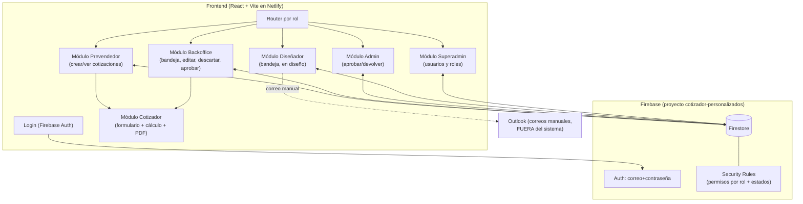
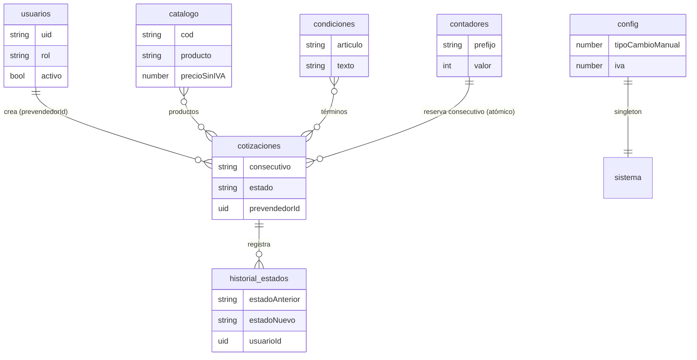

# Mapa del Sistema (grafo) — Control Interno EB

> Vista rápida de módulos, colecciones, roles y estados para orientarse **sin leer todo el código**. Mantener actualizado (Regla Absoluta #8).

---

## 1. Grafo general del sistema

---

## 2. Colecciones Firestore

| Colección | Dueño de escritura | Lectura |
|-----------|--------------------|---------|
| `usuarios` | admin | admin (y cada quien su propio doc) |
| `cotizaciones` | según rol + estado (ver ARQUITECTURA) | según rol |
| `cotizaciones/{id}/historial_estados` | quien hace la transición (append-only) | roles con acceso a la cotización |
| `catalogo` | admin / backoffice | autenticados |
| `config/general` | admin | autenticados |
| `condiciones` | admin / backoffice | autenticados |
| `contadores/{prefijo}` | prevendedor / superadmin (solo incrementos +1; sin delete) | autenticados activos |

---

## 3. Estados (referencia rápida)

`GENERADA → EN_REVISION_BACKOFFICE → PENDIENTE_ADMIN → PENDIENTE_DISENO → EN_DISENO → REVISION_FINAL_BACKOFFICE → COMPLETADA`

Entrada: `GENERADA` (al generar el PDF). Descartar: `GENERADA → ANULADA` (soft-delete, backoffice).
Ciclos de retorno: `PENDIENTE_ADMIN → EN_REVISION_BACKOFFICE` (admin devuelve) · `REVISION_FINAL_BACKOFFICE → EN_DISENO` (backoffice rechaza).

Detalle y matriz de permisos: [ARQUITECTURA.md](ARQUITECTURA.md).

---

## 4. Índice de navegación (dónde está cada cosa)

| Necesito… | Ir a |
|-----------|------|
| Reglas absolutas y visión general | [../CLAUDE.md](../CLAUDE.md) |
| Modelo de datos y máquina de estados | [ARQUITECTURA.md](ARQUITECTURA.md) |
| Cómo funcionaba el cotizador viejo | [CONTEXTO_SISTEMA.md](CONTEXTO_SISTEMA.md) |
| Código del sistema nuevo | `app/` *(desde Fase 1)* |
| Reglas de seguridad | `app/firestore.rules` *(desde Fase 2)* |
| Datos a importar | Google Sheets de la empresa + `legacy-cotizador/` |
